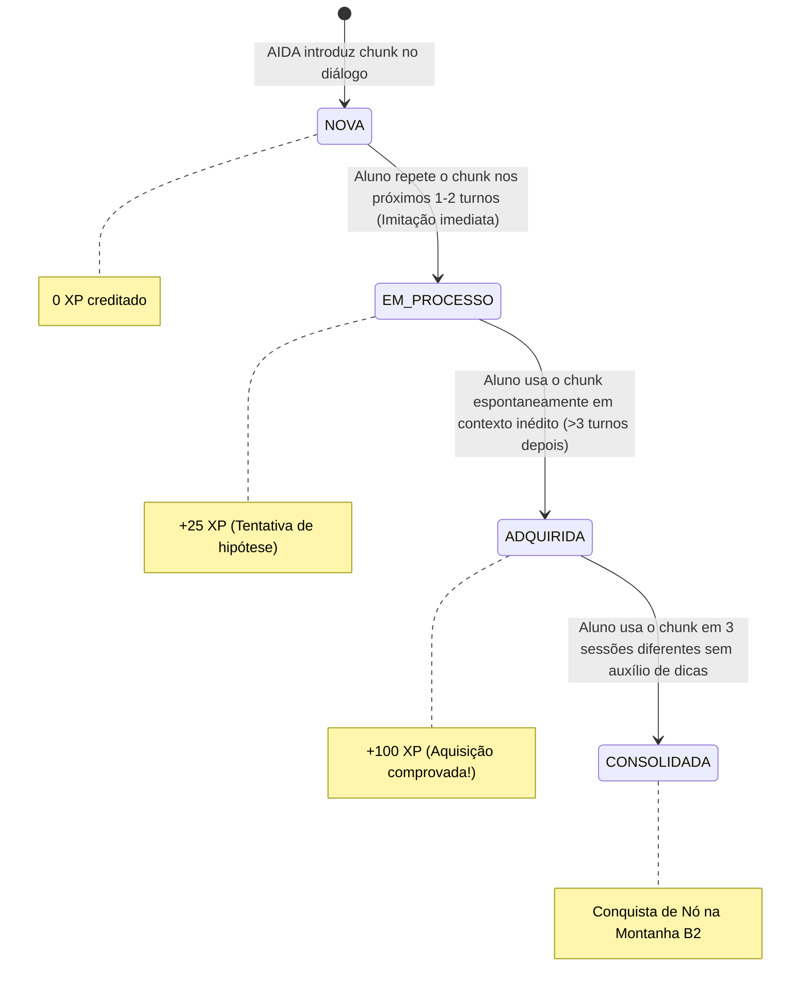
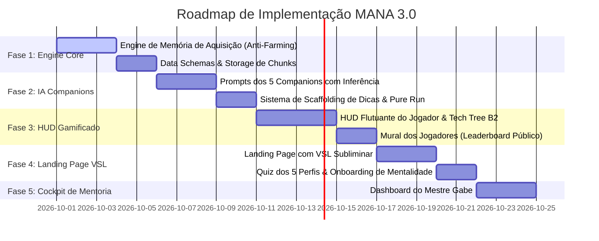

# MANA 3.0 — Arquitetura de Execução & Engenharia do Produto
## Blueprint Definitivo: Da Inferência Contextual ao "Mão na Massa"

**Mentor & Autor:** Gabe (Gabriel Lima)  
**Orquestrador Mestre:** Orion — Smart Triage Engine v5 (SDC Execution Mode)  
**Data:** Setembro de 2026  
**Status:** PRONTO PARA EXECUÇÃO ("MÃO NA MASSA")  

---

## 1. A Resolução Definitiva da Tensão: MANA vs. Duolingo

O debate crucial travado na concepção do produto foi a aparente contradição entre:
- **A Diretriz Anti-Distração do Método MANA:** Rejeição veemente da gamificação artificial e viciante do Duolingo (streaks cosméticos de 600 dias onde o aluno acerta quizzes fáceis mas não consegue falar no mundo real).
- **A Ambição de Gamificação:** O desejo de criar uma experiência envolvente, estilo RPG, que mantenha o aluno engajado diariamente.

```mermaid
graph TD
    subgraph DUO["O Modelo Duolingo (Gamificação Artificial de Retenção)"]
        D1["Quiz de Múltipla Escolha"] --> D2["XP por Repetição Mecânica (The cat is on the table)"]
        D2 --> D3["Streaks Vazios (Foco no Hábito, Não na Fala)"]
        D3 --> D4["Resultado: 600 Dias de Streak e Zero Fluência"]
    end

    subgraph MANA_GAME["O Modelo MANA 3.0 (Gamificação de Aquisição Real)"]
        M1["Cena Narrativa de Sobrevivência (RPG)"] --> M2["Inferência Contextual & Negotiation of Meaning"]
        M2 --> M3["Output Espontâneo em Contexto Inédito"]
        M3 --> M4["XP Creditado na Memória de Aquisição (Anti-Farming)"]
        M4 --> M5["Resultado: Autonomia Real (Cume da Montanha B2)"]
    end
```



### 1.1 A Chave Mestra: Gamificar a "Memória de Aquisição"
- No Duolingo, você ganha XP clicando em botões e traduzindo frases prontas. É possível "farmar" pontos sem aprender nada.
- No MANA, os pontos refletem **estruturas linguísticas assimiladas e usadas espontaneamente**:
  1. A AIDA introduz um chunk na cena.
  2. O aluno não ganha pontos por simplesmente papaguear a palavra de volta.
  3. O aluno **só ganha pontos (+100 XP)** quando o sistema detecta que ele usou a estrutura **espontaneamente em uma nova situação**, após um intervalo de turnos, sem que a IA tenha dado a deixa.
- **Isso é cientificamente defensável, biologicamente real e impossível de farmar clicando rápido.**

---

## 2. O Mecanismo da Inferência Contextual & Negotiation of Meaning

> "Você não precisa entender 100% das palavras de uma frase para compreendê-la. Você precisa de **massa crítica de contexto** suficiente para o cérebro construir a ponte."  
> — **Princípio MANA (Krashen / Long / Gabe)**

### 2.1 Como a AIDA Aplica a Inferência Contextual na Prática
O input $i+1$ só é compreensível porque o cérebro humano é uma máquina de inferência. Se a AIDA falar uma frase onde tudo é desconhecido, o aluno desiste. Se ela falar apenas o que ele já sabe, não há aprendizado.

A AIDA constrói a **massa crítica de contexto** através de 4 âncoras em cada turno:
1. **Ação Dramática Contextualizada (Stage Directions):**  
   Uso de ações entre asteriscos para ancorar o sentido: `*checks watch nervously and points to the boarding gate* "Hey! Our flight is boarding right now, we gotta move!"`
2. **Gatilhos de Informação (Information Gap):**  
   A AIDA coloca o aluno numa posição onde ele deduz o que foi dito pela necessidade imediata da cena (ex: o garçom traz a conta errada e espera a reação do aluno).
3. **Paráfrase Redundante Natural:**  
   Em vez de traduzir para o português, a AIDA reformula o conceito com palavras simples do repertório já adquirido pelo aluno.
4. **Scaffolding de Dicas sob Demanda:**  
   Se a inferência falhar e o aluno travar, ele pode tocar no botão de dica para ver a palavra-âncora traduzida, mas sabe que completando a cena no modo **Pure Run** ele ganha +50% de XP e bônus de Mana.

---

## 3. Os 5 Arquétipos de Companions de Aventura (RPG Layer)

A AIDA não é uma professora. Ela é a sua **Adventure Companion** — sua parceira de sobrevivência na dungeon do mundo real. Cada persona personifica um arquétipo de RPG:

| Companion | Arquétipo de RPG | Especialidade de Imersão | Cenários Típicos | Estilo de Comunicação |
| :--- | :--- | :--- | :--- | :--- |
| **Jordan** | *The Street Scout* | Sobrevivência Urbana & BICS Social | Bares, eventos, esportes, viagens casuais, memes | Rápido, gírias naturais, banter bem-humorado, energia alta |
| **Alexandra** | *The Vanguard Strategist* | Diplomacia Corporativa & CALP Executivo | Reuniões de diretoria, pitches, alinhamentos sob pressão | Afiada, profissional, elegante, vocabulário corporativo de elite |
| **Miles** | *The World Explorer* | Sobrevivência Global & Resolução de Crises | Aeroportos, imigração, emergências no exterior, hotelaria | Experiente, contador de histórias, prático, calmo sob caos |
| **Zack** | *The Cyber Technomancer* | Cultura Digital & Tech | Discord, startups, código, gaming, streams | Internet slang, direto, sarcasmo inteligente, cultura gamer |
| **Prof. Hayes** | *The Sage Archivist* | Retórica Avançada & Certificações | Debates acadêmicos, TOEFL/IELTS, redação formal | Estruturado, desafiador intelectual, vocabulário sofisticado e polido |

---

## 4. O Algoritmo da Memória de Aquisição (Anti-Farming Engine)

Para garantir que o XP represente competência biológica real, o motor de análise segue o seguinte autômato de estados:



### Critérios de Validação de Uso Espontâneo:
1. **Distância de Turnos ($\Delta t \ge 3$):** A estrutura não pode ter sido dita pela IA nos últimos 3 turnos (elimina imitação de papagaio).
2. **Independência Semântica:** A estrutura deve estar integrada a uma nova proposição criada pelo aluno, e não a uma resposta monossilábica copiada.
3. **Pure Run Validation:** Se a dica referente àquele chunk foi acionada na mesma sessão, o chunk vai para `EM_PROCESSO`, exigindo uma sessão futura limpa para virar `ADQUIRIDA`.

---

## 5. A Montanha do B2: Tech Tree de Habilidades

A progressão do aluno é representada visualmente como uma **Tech Tree** inspirada em RPGs, mapeando os 2.500 chunks finitos necessários para a autonomia completa:

```
[MONTANHA DO B2 - TECH TREE]
│
├── 🏔️ PLATÔ 1: O DESCONGELAMENTO (Rank E → D) [350 Chunks]
│   ├── Nó 1.1: Presença e Apresentação Pessoal
│   │   ├── 🌿 Ramificação Street: "Sup, I'm Gabe, I run things here."
│   │   └── 🌿 Ramificação Corporate: "Pleasure to meet you, I'm Gabriel, heading product."
│   └── Nó 1.2: Transações de Sobrevivência (Café, Hotel, Uber)
│
├── 🏔️ PLATÔ 2: O MOTOR DO BICS (Rank D → C) [650 Chunks]
│   ├── Nó 2.1: O Arsenal dos 50 Conectores Naturais (However, Actually, To be honest...)
│   └── Nó 2.2: Rotina, Opiniões e Preferências com Emoção
│       ├── 🌿 Ramificação Gírias: "I'm not really feeling that movie, kinda meh."
│       └── 🌿 Ramificação Formal: "I would rather explore alternative options."
│
├── 🏔️ PLATÔ 3: NARRATIVA E GESTÃO DE IMPREVISTOS (Rank C → B) [750 Chunks]
│   ├── Nó 3.1: Histórias Pessoais e Linha do Tempo (Passado sem pensar na regra)
│   └── Nó 3.2: Resolução de Crises Reais (Perdi meu passaporte / Erro na entrega do cliente)
│
├── 🏔️ PLATÔ 4: NEGOCIAÇÃO E PERSUASÃO EXECUTIVA (Rank B → Cume B2) [750 Chunks]
│   ├── Nó 4.1: Defesa de Ideias Contrárias sem Agressividade (Hedging Language)
│   └── Nó 4.2: Apresentações sob Alta Pressão (Boss Raid de Aprovação)
│
└── 👑 O CUME DO MESTRE: LAPIDAÇÃO C1/C2 (S-Rank Sovereign) [1.000 Chunks]
    ├── Nó 5.1: Sutilezas Culturais, Ironia e Humor Nativo
    └── Nó 5.2: Diplomacia Executiva C-Level e Banca de Soberania com Gabe
```

---

## 6. Plano de Ação Imediato ("Mão na Massa" — As 5 Fases do SDC)

Com a arquitetura, metodologia, PRD e GDD 100% alinhados, a transição para a implementação técnica é direta:



### Especificação dos Módulos a Desenvolver:
1. **Fase 1 (`packages/api/src/mana/acquisitionEngine.ts`):**  
   Implementar a rotina que ingere o transcript da sessão de chat com a AIDA, identifica as frases do aluno, compara com o dicionário de chunks e atualiza o estado (`NOVA` $\rightarrow$ `EM_PROCESSO` $\rightarrow$ `ADQUIRIDA`) no banco de dados.
2. **Fase 2 (`packages/api/src/mana/prompts/companions.ts`):**  
   Estruturar as diretrizes de sistema das 5 personas (Jordan, Alexandra, Miles, Zack, Hayes) com os blocos de *Stage Directions*, regras de inferência contextual, recasting sem correção explícita e entrega de dicas contextuais.
3. **Fase 3 (`packages/client/src/components/mana/PlayerHud.tsx`):**  
   Desenvolver o componente flutuante no frontend do LibreChat/Web App exibindo o Rank atual, a barra de progresso da Montanha B2, o status de *Pure Run* da sessão e os nós conquistados.
4. **Fase 4 (`packages/client/src/pages/LandingPageVSL.tsx`):**  
   Implementar a Landing Page interativa com o vídeo de Gabe, o Teste do Espelho Mental (4 dores) e a Auto-Avaliação em 5 Perfis.
5. **Fase 5 (`packages/client/src/components/mana/MentorCockpit.tsx`):**  
   Criar a visão exclusiva de Gabe para monitoramento dos alunos, com alertas de ansiedade (filtro afetivo alto), chunks dominados e debriefing das Boss Raids.
