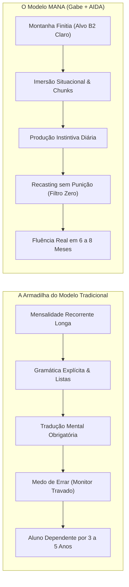
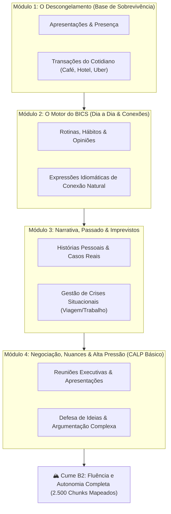
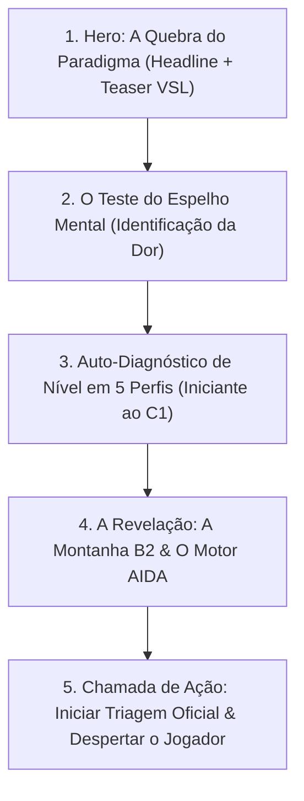

# MANA — O Protocolo do Despertar
## Onboarding Cognitivo: Mentalidade, Percepção Linguística e o Mapa da Montanha B2

> *"Você não estuda para falar. Você fala — do jeito que der — para aprender. Foi exatamente assim que você e qualquer ser humano no planeta conquistou sua língua materna."*  
> — **Gabe (Gabriel Lima)**

---

## 1. O Choque de Realidade: A Indústria do "Aluno Eterno"

A maioria dos adultos brasileiros carrega uma frustração silenciosa: anos pagando cursos de inglês famosos, preenchendo apostilas grossas ou mantendo streaks em apps de coruja verde para, no momento em que precisa falar em uma call internacional ou passar pela imigração, sentir o peito apertar e o cérebro travar.

Isso **não é uma falha sua**. Isso é o resultado do modelo de negócio para o qual você foi empurrado.

### 1.1 A Engenharia Financeira da Ineficiência
As escolas e franquias tradicionais de idiomas operam sob a lógica da **receita recorrente prolongada**:
- **Se você ficar fluente em 6 a 8 meses, a escola perde 4 anos de mensalidades, matrículas anuais e venda de material didático superfaturado.**
- O incentivo comercial dessas instituições é **esticar o seu aprendizado ao máximo**. É por isso que eles fragmentam o inglês em *Básico 1, Básico 2, Pré-Intermediário 1, 2, 3...*
- Para justificar anos de cobrança, eles precisam de algo fácil de medir no papel: **regras gramaticais e testes de múltipla escolha**. Ensinar gramática analítica em sala de aula é barato e escalável para a escola, mas é o veneno número um para a sua fala espontânea.

### 1.2 Por que a Gramática Te Deixa Mudo?
Quando você estuda uma regra (ex: a fórmula do *Present Perfect*), essa informação é armazenada no seu cérebro como **conhecimento declarativo** (como uma fórmula de física que você precisa lembrar conscientemente).  
Na hora de uma conversa em tempo real, onde as pessoas falam a 150 palavras por minuto, seu cérebro não tem tempo de puxar a regra, conjugar o verbo, conferir a preposição e traduzir mentalmente. O resultado é o congelamento: o seu **Monitor** interno apita que você vai errar, seu batimento cardíaco sobe e você se cala por vergonha.

---

## 2. A Nova Perspectiva: Como Enxergar as Palavras e a Língua

Para subir a montanha conosco, você precisa resetar como enxerga o inglês a partir de hoje:

### 2.1 Palavras Isoladas Não Existem (Pense em "Chunks" Sonoros)
- Nativos não pensam palavra por palavra. A unidade básica da fala humana é o **chunk** (o bloco sonoro contextual).
- Você não deve memorizar `"How"`, depois `"are"`, depois `"you"`. Você aprende o bloco sonoro `"Howyadoin?"` associado diretamente à intenção de cumprimentar alguém.
- Quando você foca em blocos prontos, seu cérebro dispara a fala de forma instantânea, sem precisar montar quebra-cabeças gramaticais no ar.

### 2.2 Tradução é um Desvio que Causa Delay
- Se você pensa em português para depois traduzir para o inglês, você impõe um delay de 2 a 3 segundos na sua cabeça.
- **Tradução Parcialmente Bloqueada com Dicas (Hint Scaffolding):** No MANA, a tradução é mantida bloqueada por padrão para obrigar o seu cérebro a conectar o som/texto direto com o conceito. No entanto, para evitar frustração desnecessária, você pode acionar **dicas de palavras-chave**.
- 💎 **Bônus Pure Run:** A cada atividade ou missão concluída **sem recorrer a nenhuma dica de tradução**, você recebe recompensas extras de XP e Mana, subindo no ranking muito mais rápido.

### 2.3 O Erro é Evidência Biológica de Aprendizado
- Nenhuma criança aprende a andar sem tropeçar. Cada frase imperfeita que você emite é um disparo neural que o cérebro usa para testar uma hipótese de comunicação.
- Na AIDA e nas mentorias com Gabe, **o erro nunca é punido ou exposto de forma vergonhosa**. Ele é simplesmente absorvido e refinado no fluxo da conversa.

---

## 3. A Montanha do B2: Roadmap Finito de Conquistas e Ramificações

Diferente dos cursos que nunca acabam, o MANA apresenta a sua jornada como **uma montanha com topo visível e demarcado: O Nível B2**.

### 3.1 A Estrutura dos Módulos Finitos
1. **Totalmente Mapeado:** O vocabulário e os contextos necessários para atingir o nível B2 (independência para morar fora, viajar o mundo e conduzir reuniões profissionais) somam cerca de **2.500 chunks essenciais**. Você enxerga a montanha inteira desde o primeiro dia.
2. **Conquista de Nós e Ramificações de Maestria:**
   - Ao dominar um contexto básico (ex: *"Fazer um pedido em um restaurante"*), você conquista o nó principal.
   - Imediatamente, o sistema libera **novas ramificações** daquele mesmo contexto para afiar sua habilidade:
     - *Ramificação Casual/Gírias:* Como pedir em uma lanchonete descolada de Nova York usando gírias autênticas.
     - *Ramificação Formal/Executiva:* Como conduzir um jantar de negócios com investidores internacionais com extrema polidez.
3. **O Mural dos Jogadores (Ranking Público & Competitividade Positiva):**
   - O progresso de todos os alunos fica exposto em um dashboard de Jogadores em tempo real.
   - Você vê quem está escalando os mesmos platôs que você, quem concluiu as Daily Quests do dia com *Pure Run* e quem derrotou as Boss Raids da semana, estimulando um senso de tribo e superação mútua.

---

## 4. Alinhamento de Expectativas: O que Esperar de Cada Pilar

Para que a engrenagem funcione com precisão cirúrgica:

### O Que Esperar de Você Mesmo:
- **Nos primeiros 10 dias:** Você vai se sentir ligeiramente desajeitado e vai querer traduzir mentalmente. Isso é o seu cérebro antigo reclamando. Mantenha os 10 minutos diários e a mágica acontece.
- **Autorização para Errar:** Se você tentar falar bonito logo no dia 1, você trava. Fale simples, fale misturado, use as mãos se for em vídeo. Apenas produza.

### O Que Esperar da AIDA (Sua Sparring Partner 24/7):
- **Zero Julgamento:** A AIDA não cansa, não se irrita, não ri do seu sotaque e não tem pressa. Ela é o seu campo seguro de treino.
- **Recasting Invisível:** Se você disser *"I have 30 years"*, ela responde *"Oh, you're 30 years old? Great age to build your career!"*. O modelo correto é absorvido pelos seus neurônios auditivos sem constrangimento.
- **Dicas Inteligentes:** Travou na palavra? Toque para ver a dica da palavra-chave. Quer mais XP? Tente responder sem olhar.

### O Que Esperar do Gabe (Seu Mentor Estratégico):
- **Desbloqueador de Crenças:** Gabe identifica o ponto exato onde a sua mente está hesitando e remove o obstáculo com técnicas personalizadas.
- **Refinador de Estilo e Sotaque:** Nas mentorias ao vivo, Gabe não gasta seu tempo ensinando regras que uma IA ensina. Ele atua na sua musicalidade, ritmo de fala (stress-timed), elegância corporativa e debriefing das suas Boss Raids.

---

## 5. Arquitetura da Landing Page: A "VSL Subliminar Gamificada" (Topo de Funil)

A Landing Page não é uma página de vendas comum com textos cansativos. Ela é uma **experiência imersiva que diagnostica e converte o aluno enquanto ele joga**.

### Seção 1: O Gancho Hero (A Verdade Inconveniente)
- **Headline:** *"Você não precisa de 4 anos de cursinho. Você precisa de 6 meses do método biológico certo."*
- **Sub-headline:** *"Descubra por que o método tradicional foi desenhado para te manter pagando mensalidade, e como o protocolo MANA ativa a sua fala espontânea usando IA de imersão e o mapa da Montanha B2."*
- **Mini-VSL Interativa (3 minutos):** Gabe explicando a neurobiologia da aquisição em tom direto, visceral e magnético.

---

### Seção 2: O Teste do Espelho Mental (Personalizado em Níveis de Dor)
*Pergunta Interativa:* **"Quando você precisa falar em inglês, qual destas frases melhor descreve o que acontece dentro da sua mente?"**

- [ ] **Opção 1 — O Iniciante com Sobrecarga (A1/A2 Inicial):**  
  *"Começo a pensar em português, me perco tentando achar as palavras certas no dicionário da minha cabeça e desisto por achar que não nasci com dom para línguas."*
- [ ] **Opção 2 — O Travado Clássico (A2/B1 Inibido):**  
  *"Eu entendo quase tudo quando leio ou assisto uma série, mas na hora de abrir a boca meu cérebro congela. Tenho pavor de cometer um erro bobo na frente dos outros."*
- [ ] **Opção 3 — O Intermediário com Vocabulário Infantil (B1/B2 Funcional):**  
  *"Consigo me virar e resolver coisas básicas, mas sinto que meu inglês é travado e infantil. Repito sempre as mesmas 5 palavras, uso conectores pobres e demoro para engatar frases longas."*
- [ ] **Opção 4 — O Praticante com Platô de Refinamento (B2/C1 Avançado):**  
  *"Já participo de reuniões e consigo me comunicar em inglês, mas sinto que falta sofisticação, ritmo nativo e sutileza. Cometo erros que ninguém me corrige por educação e quero soar impecável e respeitado."*

---

### Seção 3: Auto-Avaliação de Nível (5 Perfis Estratégicos)
*Pergunta Interativa:* **"Qual é a sua relação real com o idioma hoje?"**

- [ ] **Perfil 1: O Zero Absoluto (Nível A1)**  
  *"Nunca estudei de verdade ou só me lembro de palavras soltas. Quero começar do zero, sem vergonha e com um mapa claro."*
- [ ] **Perfil 2: O Básico Traumatizado (Nível A2)**  
  *"Já fiz anos de curso, conheço algumas regras gramaticais, mas não consigo formular 3 frases seguidas sem gaguejar ou travar."*
- [ ] **Perfil 3: O Intermediário Bloqueado (Nível B1)**  
  *"Entendo bem conversas e textos, consigo me comunicar de forma lenta, mas ainda traduzo mentalmente e dependo de pausas para pensar."*
- [ ] **Perfil 4: O Profissional em Lapidação (Nível B2 — Refinamento de Nicho)**  
  *"Já trabalho ou estudo em inglês e sou funcional, mas quero destravar naturalidade, vocabulário corporativo de elite, sotaque rítmico e eliminar qualquer hesitação em reuniões de alto impacto."*
- [ ] **Perfil 5: O Quase Nativo Rumo à Soberania (Nível C1/C2 — Alta Performance)**  
  *"Já sou fluente e me comunico diariamente, mas busco maestria absoluta: dominar nuances culturais, argumentação de ponta, humor sofisticado e autoridade vocal irretocável."*

---

### Seção 4: O Vislumbre da Solução & Chamada para Ação
Ao responder o quiz interativo, a página calcula o perfil do aluno em tempo real e exibe:
1. O diagnóstico da sua maior âncora de travamento.
2. A rota recomendada na **Montanha do B2** (ou a Trilha de Refinamento C1 se selecionou Perfil 4/5).
3. O botão de ativação: **"Entrar no Protocolo do Despertar & Começar Triagem com Gabe e AIDA"**.
