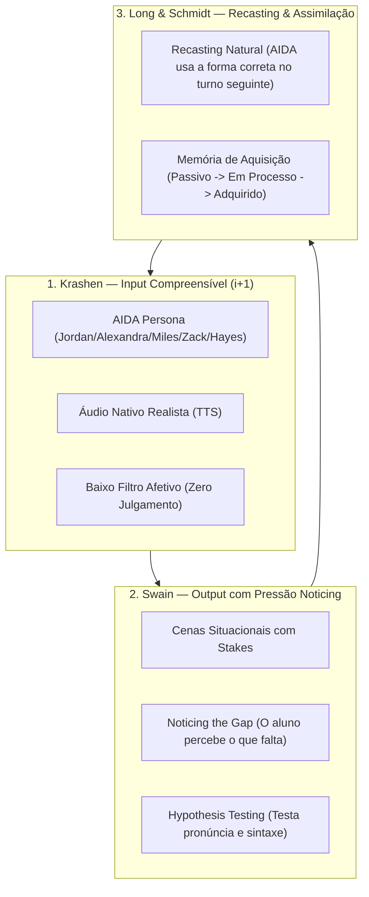

# MANA 3.0 — Método de Aquisição Natural Acelerada + Gamified AI
## Product Requirements Document (PRD) & Game Design Document (GDD)

**Versão:** 3.0 (Definitive)  
**Status:** APPROVED / IN EXECUTION  
**Orquestrador:** Orion — Smart Triage Engine v5 (Tier 2 SDC Pipeline)  
**Autores:** @pm (Morgan), @architect, @qa, @alan (MindClone v6.0) & Gabriel Lima (Gabe)  
**Repositório:** [Gabe's English Classes / my-aida-agents-hub](file:///c:/Users/Usuario/Documents/My%20KAIROS/Gabe's%20English%20Classes/my-aida-agents-hub)  

---

## 1. Visão Geral e Tese do Produto

### 1.1 O Grande Paradoxo do Ensino de Idiomas
O mercado tradicional de ensino de línguas oscila entre dois extremos ineficazes:
1. **O Modelo Escolar Tradicional:** Foco em gramática explícita, listas descontextualizadas e tradução mental direta. O aluno estuda 5 anos e trava ao tentar pedir um café em Nova York.
2. **O Modelo Gamificado Superficial (Duolingo):** Streaks artificiais de 600 dias, quizzes de múltipla escolha e pontuações cosméticas. O aluno acumula badges, mas não desenvolve automaticidade neuromotora e congela na primeira conversa espontânea.

### 1.2 A Solução MANA 3.0 (Híbrido de Alta Performance)
O MANA 3.0 integra:
- **Mentoria Humana Estratégica (Gabe):** Sessões pontuais ao vivo focadas em desbloqueio psicológico, calibração de metas e avaliação situacional de alto impacto (Checkpoints de Boss).
- **Agente de Imersão Autônomo 24/7 (AIDA):** Prática diária sem fricção, alimentada por LLMs calibrados, síntese de voz nativa (TTS) e inteligência de *recasting* sem interrupções punitivas.
- **Motor de Gamificação de Competência Real (Solo Leveling HUD):** Uma camada de RPG onde o aluno é um "Jogador de Fluencia", subindo de Rank (E $\rightarrow$ S) através de **Daily Quests** e da expansão comprovada da sua **Memória de Aquisição** (estruturas utilizadas espontaneamente sem auxílio de tradutor).

---

## 2. Fundamentação Pedagógica (Krashen + Swain + Cummins)



### 2.1 Stephen Krashen — Hipótese de Entrada e Filtro Afetivo
- **$i+1$ Automático:** A AIDA dosa cada turno de diálogo para estar apenas 1 degrau acima do repertório demonstrado pelo aluno.
- **Filtro Afetivo Zero:** O aluno nunca é constrangido com avisos de "Você errou", notas vermelhas ou interrupções de fluxo. O erro é tratado como sinal natural de desenvolvimento.

### 2.2 Merrill Swain — Hipótese do Output Compreensível
- **Noticing Function:** A prática ativa (escrever ou falar) força o cérebro a reconhecer onde estão seus limites comunicativos (*gaps*).
- **Hypothesis-Testing:** O aluno formula tentativas; ao ser compreendido pela AIDA na cena, sua hipótese é validada no córtex associativo.

### 2.3 Jim Cummins — BICS vs. CALP
- O MANA 3.0 prioriza a fluência conversacional instintiva (**BICS** - *Basic Interpersonal Communicative Skills*) nos primeiros meses, e apenas transiciona para competência corporativa/acadêmica sofisticada (**CALP** - *Cognitive Academic Language Proficiency*) nos Ranks mais avançados.

---

## 2.4 Fase 0: Onboarding de Mentalidade & Desbloqueio Cognitivo (Pré-Calibração)
Antes de qualquer interação com a AIDA ou triagem de calibração, o aluno passa pelo **Protocolo do Despertar** (na Landing Page / Onboarding Inicial do App), detalhado em [ONBOARDING-MENTALIDADE-MANA.md](file:///c:/Users/Usuario/Documents/My%20KAIROS/Gabe's%20English%20Classes/my-aida-agents-hub/docs/ONBOARDING-MENTALIDADE-MANA.md):
- **Desmistificação da Tradução Mental:** Explicar o atraso neural (2-3s) causado pela tradução palavra por palavra.
- **Conceito de Chunks Sonoros:** Ensinar a perceber blocos de som e contexto em vez de palavras isoladas de dicionário.
- **O Erro como Hipótese Biológica:** Redução imediata do filtro afetivo de Krashen; normalização absoluta do erro.
- **O Alinhamento com a AIDA:** Esclarecer por que a IA não corrige explicitamente (recasting orgânico) e por que não traduz para o português.
- **O Pacto do Jogador:** O aluno assume o compromisso de se autorizar a falar errado, evitar tradutores e manter consistência diária. Isso zera a ansiedade e torna a **Triagem de Calibração de Rank 10x mais precisa e fluida**.

---

## 3. Game Design Document (GDD): O Sistema do Jogador

> [!IMPORTANT]
> **A Regra de Ouro da Gamificação MANA:**
> A interface do jogo (o "HUD do Jogador") é **totalmente desacoplada** da conversa com a AIDA.
> Dentro do chat, a AIDA nunca menciona "XP", "pontos" ou "quests". Ela é 100% imersiva.
> O jogo existe na camada de plataforma (HUD flutuante, dashboard, relatórios e conquistas).

```mermaid
journey
    title A Jornada do Jogador de Fluencia (MANA 3.0)
    section E-Rank: O Descongelamento
      Triagem Diagnóstica conversacional: 5: Aluno
      Primeiro sucesso nos primeiros 60s: 5: Aluno, AIDA
      Desbloqueio de 30 chunks diários: 4: Aluno
    section D/C-Rank: A Construção do Fluxo
      Daily Quests de 5-15 min: 5: Aluno
      Roleplays de Sobrevivência (Aeroporto, Restaurante): 4: Aluno, AIDA
      Redução da latência de resposta: 4: Aluno
    section B/A-Rank: Domínio Situacional
      Simulações profissionais com Alexandra: 4: Aluno, AIDA
      Boss Raid: Entrevista em inglês sem travar: 5: Aluno, Gabe
    section S-Rank: Soberania Fluente
      Debates complexos e improviso nativo: 5: Aluno, AIDA, Gabe
```

### 3.1 Ranks de Jogador (Sistema de Progressão)

| Rank | Título | CEFR Alinhado | Foco Pedagógico (MANA) | Critério de Desbloqueio |
| :--- | :--- | :--- | :--- | :--- |
| **E-Rank** | *Novice Babbler* | A1 | Descongelamento e perda do medo de errar | 10 sessões concluídas + 30 chunks adquiridos |
| **D-Rank** | *Street Pathfinder* | A2 | Sobrevivência diária e BICS básico | 15 turnos fluidos + Boss Raid: O Aeroporto Caótico |
| **C-Rank** | *Conversational Player* | B1 | Fluência funcional e fim da tradução mental | 20 min sem silêncio prolongado + 100 chunks adquiridos |
| **B-Rank** | *Corporate Vanguard* | B2 | Argumentação, nuances e vocabulário profissional | Boss Raid: Apresentação de Projeto sob Pressão |
| **A-Rank** | *Articulate Sovereign* | C1 | Fluência sob alta complexidade, humor e CALP | Boss Raid: Negociação Hostil ou Entrevista C-Level |
| **S-Rank** | *Native Shadow* | C2 | Espontaneidade perfeita, sotaque polido e improviso | Aprovação Direta pelo Mestre Gabe em Banca |

### 3.2 O Motor de Daily Quests (Missões Diárias de 5 a 15 Minutos)
A cada 24 horas, o sistema gera 3 Daily Quests para o aluno, calibradas pelo seu perfil diagnosticado:
1. **Quest 1: Daily Audio Echo (Listening & Shadowing)**
   - O aluno escuta 2 blocos sonoros nativos gerados via TTS pela persona e reproduz por áudio (STT).
   - *Recompensa:* +50 XP + 20 Mana.
2. **Quest 2: Situational Sprint (Roleplay de Imersão)**
   - Troca de 6 a 10 turnos com a AIDA resolvendo uma situação concreta do seu nicho (ex: cancelar uma reserva, pedir instruções na rua).
   - *Recompensa:* +100 XP + 30 Mana.
3. **Quest 3: Spontaneous Recall (Uso de Chunks em Processo)**
   - O sistema desafia o aluno a usar uma expressão assimilada recentemente em uma conversa aberta.
   - *Recompensa:* +150 XP + 50 Mana.

### 3.3 A "Memória de Aquisição" (O Core IP do MANA)
A pontuação não mede respostas certas em testes fechados. Ela audita o log da conversa em segundo plano e classifica as estruturas linguísticas do aluno em 3 estados:
- `NOVA` ($0$ XP): Estrutura apresentada pela AIDA na cena, mas nunca reproduzida pelo aluno.
- `EM_PROCESSO` ($+25$ XP): Estrutura utilizada pelo aluno logo após a AIDA ter falado (imitação imediata).
- `ADQUIRIDA` ($+100$ XP): Estrutura utilizada pelo aluno **espontaneamente em um contexto inédito**, sem que a AIDA a tenha mencionado nos últimos 3 turnos. Isso comprova que a estrutura foi internalizada no cérebro.

### 3.4 Boss Raids Quinzenais (Checkpoints de Tensão)
A cada duas semanas, o aluno desbloqueia uma **Boss Raid**:
- Uma simulação imersiva de alta tensão comunicativa (ex: seu voo foi cancelado e o último hotel tem 1 vaga; ou seu chefe estrangeiro pediu justificativa para um atraso crítico).
- O desempenho é avaliado em 4 pilares: *Resiliência de Comunicação, Redução de Pausas, Precisão de Chunks e Ausência de Tradução em Português*.
- O Boss Raid serve de insumo direto para Gabe na aula de mentoria ao vivo.

### 3.5 A Montanha do B2: Roadmap Finito e Árvore de Ramificações (Skill Tree)
- **Finitude Motivadora:** Em oposição aos cursos infinitos tradicionais, o aluno enxerga a montanha inteira: 4 Módulos principais cobrindo os **2.500 chunks essenciais** que levam ao nível B2 independente.
- **Ramificações de Variação:** Ao conquistar um nó situacional (ex: transação em restaurante), o sistema destrava sub-galhos para afiar a lâmina:
  - *Ramificação Gírias/Casual (Street):* Formas coloquiais nativas.
  - *Ramificação Executiva/Formal (Corporate):* Formas polidas de negócios.
- **Transição C1/C2 para Alunos Avançados:** Módulos de topo de montanha dedicados a debate, persuasão e refinamento sutil para quem já fala e quer lapidar.

### 3.6 Tradução Parcialmente Bloqueada (Scaffolding de Dicas & Pure Run Bonus)
- A tradução é bloqueada por padrão para recondicionar os caminhos neurais.
- O aluno pode clicar em "Dica" para revelar a tradução de âncoras-chave, evitando frustração e paralisia.
- **Bônus Pure Run:** Sessões e missões concluídas **sem utilizar dicas** concedem $+50\%$ de XP e +Mana, acelerando a subida no ranking.

### 3.7 Mural dos Jogadores (Ranking Público & Competitividade Positiva)
- Leaderboard global visível para toda a comunidade de alunos.
- Exibe o progresso em tempo real (Rank, nós conquistados na Montanha B2, Pure Runs acumulados e dias de streak).
- Transforma a solidão do estudo individual em uma jornada de guilda compartilhada.

---

## 4. Estrutura do Produto Híbrido (Gabe + AIDA)

| Componente | Responsável | Frequência | Objetivo |
| :--- | :--- | :--- | :--- |
| **Onboarding VSL & Mentalidade** | Web App / Landing Page | Entrada | Desmistificar a indústria tradicional, alinhar expectativas e aplicar o Quiz dos 5 Perfis |
| **Triagem Diagnóstica** | AIDA (Conversacional) | Entrada (Onboarding) | Classificar aluno (P1 a P5) com base no quiz e na produção espontânea sem ansiedade |
| **Imersão Diária Autônoma** | AIDA + Gamificação | Diária (5-15 min) | Prática contínua de output, listening e acúmulo de XP na Memória de Aquisição |
| **Mentoria Estratégica ao Vivo** | Gabe (Gabriel Lima) | Semanal ou Quinzenal | Desbloqueio de crenças, debriefing das Boss Raids e refinamento de sotaque/estratégia |
| **Cockpit do Professor** | Sistema Web | Sob demanda | Painel com métricas de evolução, chunks adquiridos e alertas de alunos travados |

---

## 5. Personas da AIDA (Elenco de Imersão)

1. **Jordan (24 anos, Austin - TX):** Descontraído, gamer, viciado em cultura pop e memes. Ideal para quem quer conversação social livre e naturalidade.
2. **Alexandra (31 anos, Chicago - IL):** Executiva Fortune 500, direta, prática, mentora corporativa. Ideal para quem precisa de inglês para negócios, reuniões e liderança.
3. **Miles (38 anos, Nômade Global - 55 países):** Contador de histórias, viajante experiente, especialista em sobrevivência no exterior e situações de viagem.
4. **Zack (22 anos, San Jose - CA):** Streamer, desenvolvedor, linguagem de internet, Discord e tecnologia.
5. **Prof. Hayes (52 anos, Boston - MA):** Acadêmico, refinado, especialista em certificações (IELTS/TOEFL) e redação formal.

---

## 6. Topo de Funil: A VSL Subliminar Gamificada (Landing Page)
A Landing Page atua como um cavalo de troia pedagógico: educa o lead sobre a armadilha do modelo tradicional de ensino e aplica um auto-diagnóstico em 2 etapas:
1. **O Teste do Espelho Mental:** Identifica em qual dos 4 estados de dor o aluno se encontra (Iniciante sobrecarregado, Travado clássico, Intermediário infantilizado ou Praticante em platô).
2. **Auto-Avaliação em 5 Perfis:**
   - *Perfil 1 (A1 - Zero Absoluto)*
   - *Perfil 2 (A2 - Básico Traumatizado)*
   - *Perfil 3 (B1 - Intermediário Bloqueado)*
   - *Perfil 4 (B2 - Profissional em Lapidação / Refinamento de Nicho)*
   - *Perfil 5 (C1/C2 - Soberania e Alta Performance)*
Ao finalizar, o lead é conduzido organicamente para o ambiente de imersão da AIDA e para a mentoria com Gabe.
